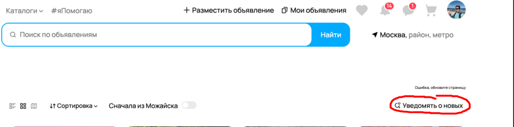
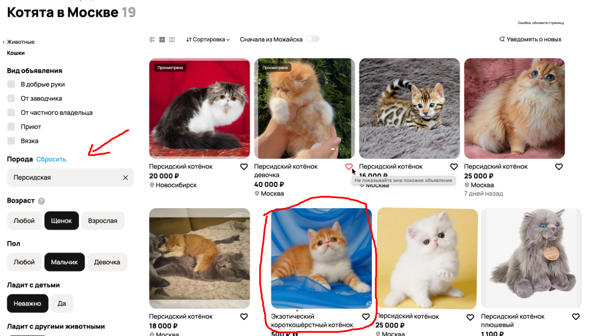
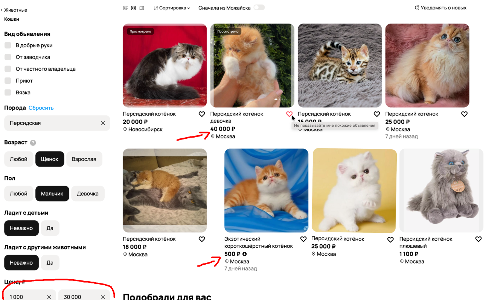
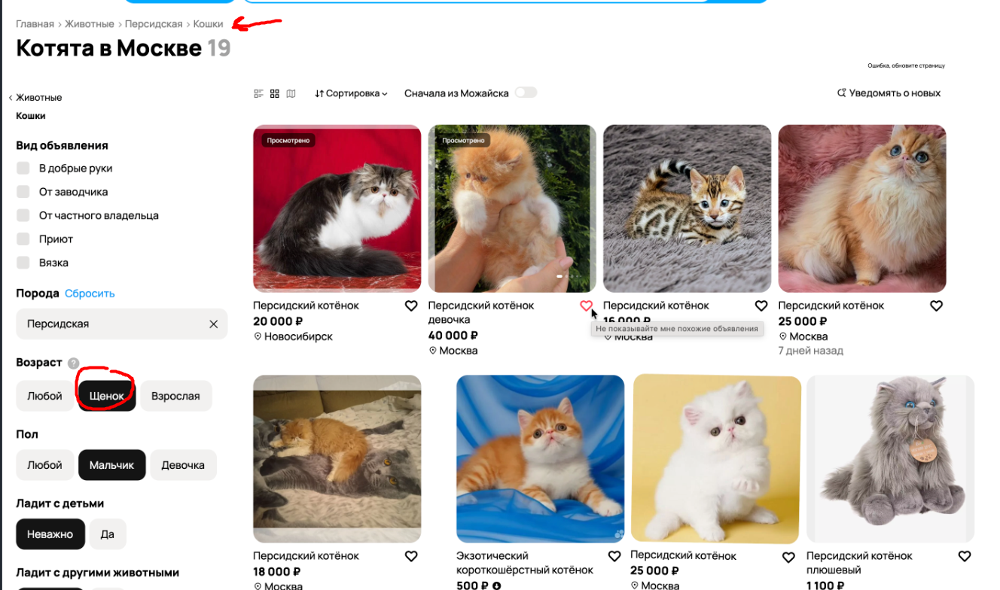
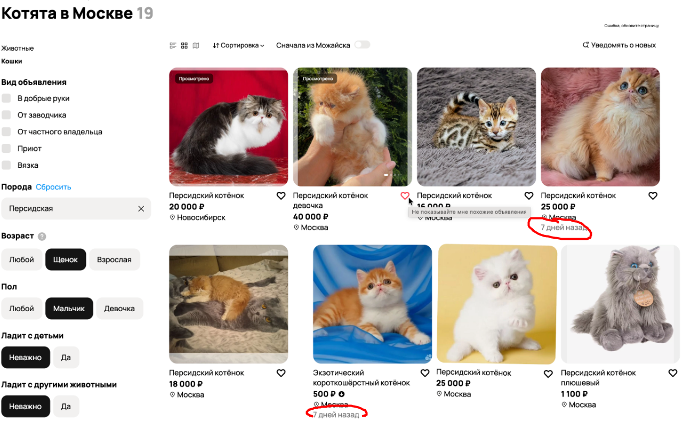
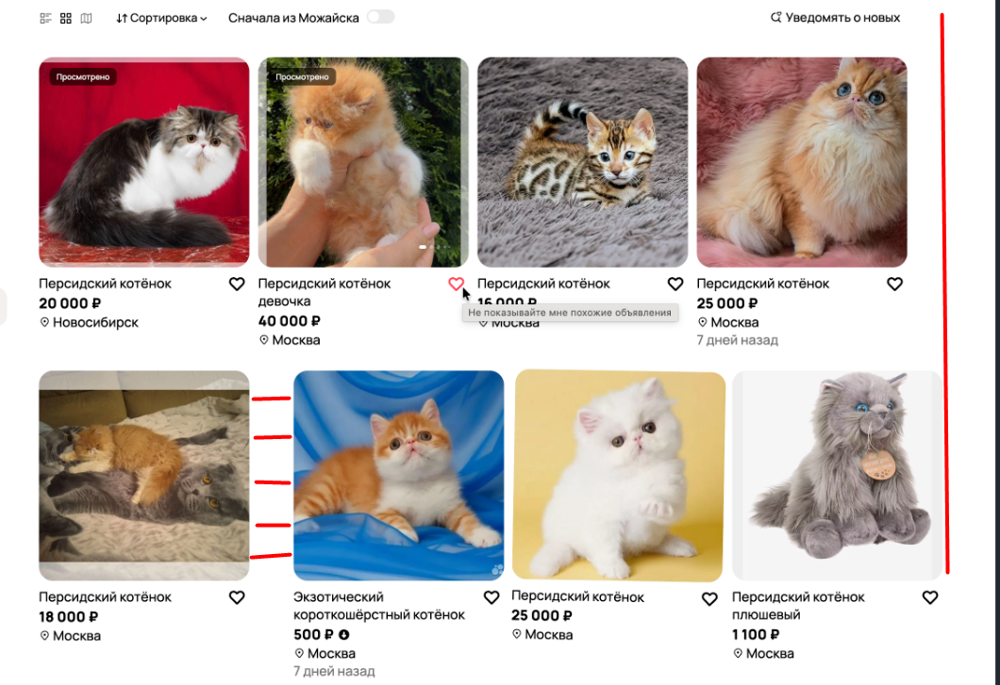
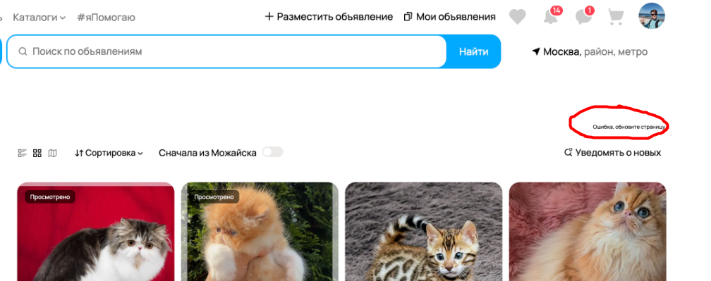
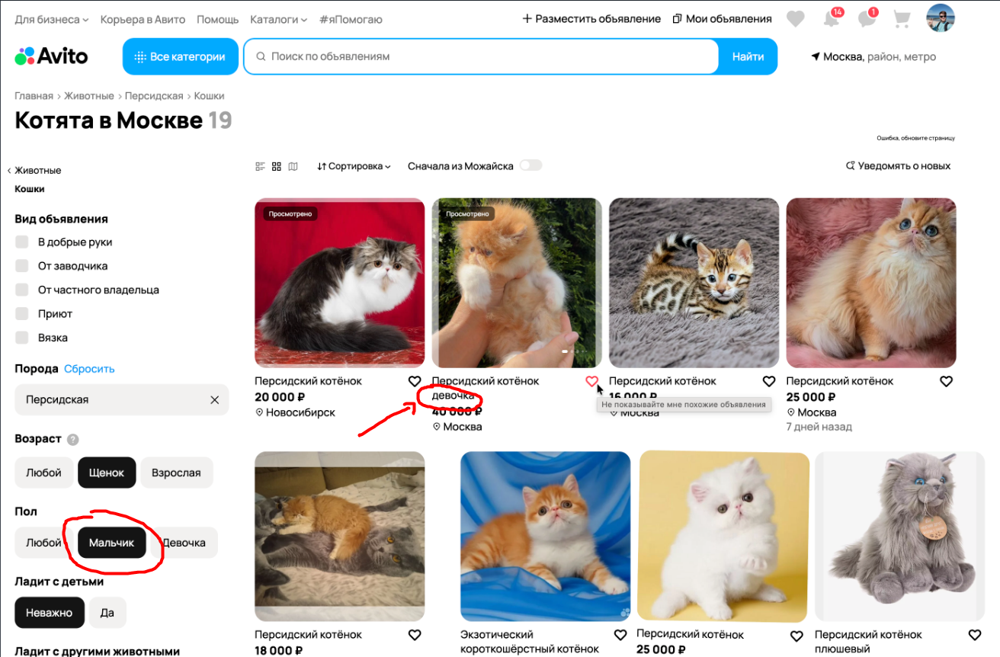
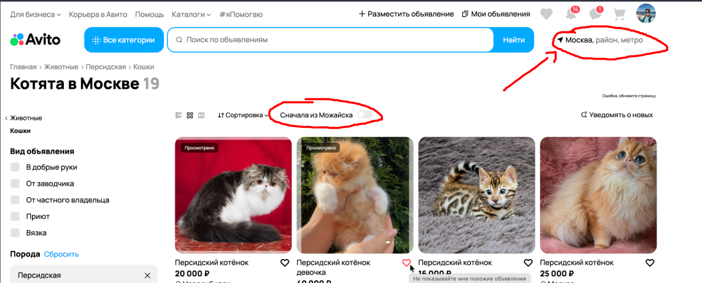
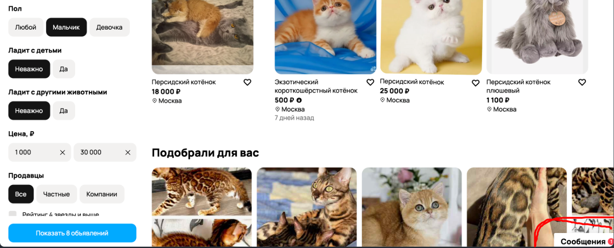

# Баг-репорты

## 1) P2 - Синтаксическая ошибка “Уведомлять”
**Описание:** На кнопке для включения уведомлений о новых объявлениях допущена синтаксическая ошибка. Написано "Уведомять", правильно: "Уведомлять".

**Скриншот:**

---

## 2) P1 - Несоответствие фильтру “Персидская”
**Описание:** По фильтру “Персидская” в поиске отображается объявление “Экзотический короткошёрстный котёнок”, что не соответствует выбранному фильтру.

**Скриншот:**

---

## 3) P1 - Несоответствие ценовому диапазону
**Описание:** В результирующем наборе объявлений есть объявления с ценой 40.000 и 500 руб. В фильтре указан диапазон от 1.000 до 30.000 руб.

**Скриншот:**

---

## 4) P2 - Несоответствие навигации
**Описание:** Навигационная стрелка для возврата не совпадает с хлебными крошками. При нажатии на стрелку возврат происходит на страницу “Животные”, в то время как в хлебных крошках отображается еще страница “Персидская”.

---

## 5) P2 - Несоответствие геолокации в поиске
**Описание:** По поисковому запросу “Котята в Москве” выдается объявление из Новосибирска.

---

## 6) P1 - Некорректный фильтр “Возраст”
**Описание:** В фильтре “Возраст” для кошек присутствует вариант “Щенок”, что не соответствует категории.

**Скриншот:**

---

## 7) P3 - Отсутствие негативных вариантов в фильтрах
**Описание:** Фильтры “Ладит с детьми” и “Ладит с животными” не содержат варианта “Не ладят”, доступны только “Да” и “Не важно”.

---

## 8) P2 - Нестабильное отображение даты публикации
**Описание:** Количество дней с момента публикации объявления присутствует только на 2 из 8 карточек товара.

**Скриншот:**

---

## 9) P2 - Отсутствие рейтинга в карточке
**Описание:** В фильтрах есть пункт “Рейтинг 4 звезды и выше”, но на маленькой карточке товара отсутствует упоминание о каком-либо рейтинге.

---

## 10) P1 - Некорректный текст при наведении
**Описание:** При наведении на кнопку для лайка объявления отображается текст “Не показывайте мне похожие объявления”.

---

## 11) P2 - Некорректное отображение карточек
**Описание:** Карточки объявлений “съехали” (некорректно отображаются) относительно страницы.

**Скриншот:**

---

## 12) P3 - Нестатичное расположение местоположения
**Описание:** Месторасположение на карточке объявлений расположено не статически, зависит от размера заголовка.

---

## 13) P1 - Несоответствие категории
**Описание:** Объявление “Персидский котёнок плюшевый” не соответствует категории “Кошки”, так как это игрушка.

---

## 14) P1 - Некорректное отображение ошибки
**Описание:** Отображается ошибка “Ошибка, обновите страницу”, но при этом страница загружена, и пользователю не понятно, что именно не загрузилось.

**Скриншот:**

---

## 15) P3 - Непонятный заголовок
**Описание:** Заголовок “Котята в Москве 19” не содержит пояснений — не понятно, что значит число 19.

---

## 16) P2 - Несоответствие кнопки и заголовка
**Описание:** Кнопка “Показать 8 объявлений” не соответствует числу 19 в заголовке “Котята в Москве 19”.

---

## 17) P1 - Несоответствие фильтру по полу
**Описание:** С примененным фильтром по полу “Мальчик” выдается объявление с названием “Персидский котёнок девочка”.

**Скриншот:**

---

## 18) P1 - Нарушен логический порядок хлебных крошек
**Описание:** Логический порядок в блоке хлебных крошек нарушен: идет “Персидская → Кошки”, должно быть “Кошки → Персидская”.

---

## 19) P1 - Некорректное содержание фильтра
**Описание:** Некорректное содержание фильтра “Сначала из Можайска” при геолокации Москва.

**Скриншот:**

---

## 20) P2 - Перекрытие интерфейса
**Описание:** Окно уведомления о новом сообщении перекрывает объявления (расположено справа снизу).

**Скриншот:**

